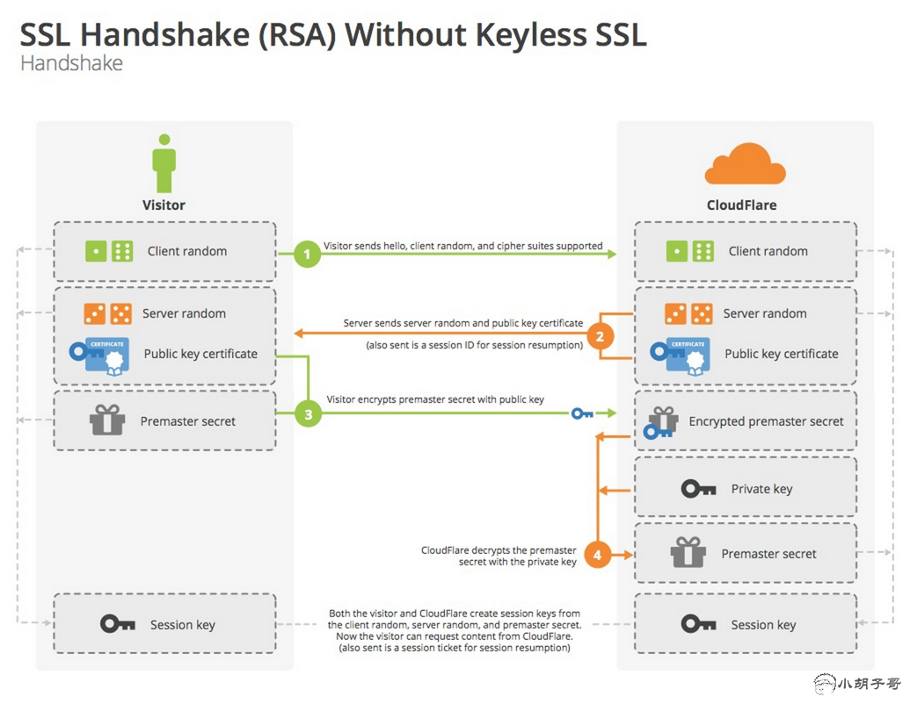
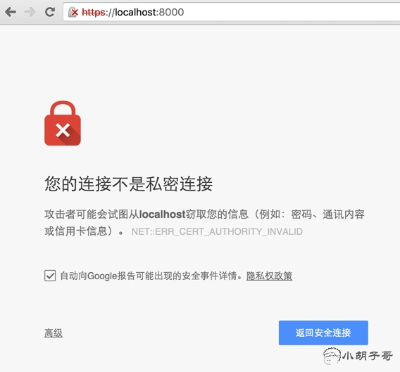

https整数生成原理和部署细节
========================

## 网站部署HTTPS的重要性

看看下面，部分电信用户访问进洞首页的时候，会看到右下角有一个浮动广告：


小白用户以为京东自己有意放置的，细心的用户发现，这个iframe一层嵌一层的恶心广告。很明显是电信/中间人通过DNS劫持注入进去的，十分反感，没有关闭按钮。

随着互联网的快速发展，我们几乎离不开网络，聊天，预定酒店、购物等等。我们的隐私无时无刻不暴露在这个庞大的网络之中，HTTPS能够让信息在网络中的传递更加安全，增加了haker的攻击成本。

HTTPS区别于HTTP，它多了加密（encryption），认证（verification），鉴定（identification）。它的安全源自非对称加密以及第三方的CA认证。

## 简述https的运作



如上图所示，简述如下：

*	客户端生成一个随机数`random-client`，传递到服务器端（say hello）
*	服务端生成一个随机数`random-server`，和公钥，一起返回给客户端（i got it）
*	客户端收到的东西原封不动，加上`premaster secret`（通过 `random-client` `random-server` 经过一定算法生成的东西），再一次发送给服务端，这次传过去的东西使用公钥加密
*	服务端先使用私钥解密，拿到`premaster secret`，此时客户端和服务端都拥有了三个要素：`random-client` `random-server` 和`premaster secret`
*	此时安全通道已经建立，以后的交流都会小燕上面的三个要素通过算法算出来的`session key`

## CA数字证书认证中心

如果网站只靠上如运作，可能会被中间人攻击，试想一下，在客户端和服务端中间有一个中间人，两者之间的传输对中间人来说是透明的，那么中间人完全可以获取两端之间的任何数据，然后将数据原封不动的转发给两端，有中间人也拿到了三要素和公钥，它照样可以解密出书内容，并且还可以窜改内容。

为了确保我们数据的安全，我们还需要一个CA整数。HTTPS的传输采用非对称加密，一组非对称加密秘钥包含公钥和私钥，通过公钥加密的内容只有私钥才能够解密。上面我们卡到，整个传输过程，服务器端是没有透露私钥的。而CA数字认证涉及到私钥，整个过程比较复杂。

CA认证分为三类： DV（domai nvalidation），OV（organization validation），EV（extended validation），证书申请难度从前往后依次递增，貌似EV这种不仅仅是有钱就可以申请的。

对于一般的小型网站尤其是博客，可以使用自签名来构建安全网络，所谓自签名证书，就是自己扮演CA机构，自己给自己的吴福气颁发证书。

## 生成秘钥，证书

第一步，为服务端和客户准备公钥、私钥

```

# 生成服务器端私钥
openssl genrsa -out server.key 1024
# 生成服务器端公钥
openssl rsa -in server.key -pubout -out server.pem
# 生成客户端私钥
openssl genrsa -out client.key 1024
# 生成客户端公钥
openssl rsa -in client.key -pubout -out client.pem


```

第二部，生成CA证书

```

# 生成 CA 私钥
openssl genrsa -out ca.key 1024
# X.509 Certificate Signing Request (CSR) Management.
openssl req -new -key ca.key -out ca.csr
# X.509 Certificate Data Management.
openssl x509 -req -in ca.csr -signkey ca.key -out ca.crt


```

在执行第二部时会出现：

```

➜  keys  openssl req -new -key ca.key -out ca.csr
You are about to be asked to enter information that will be incorporated
into your certificate request.
What you are about to enter is what is called a Distinguished Name or a DN.
There are quite a few fields but you can leave some blank
For some fields there will be a default value,
If you enter '.', the field will be left blank.
-----
Country Name (2 letter code) [AU]:CN
State or Province Name (full name) [Some-State]:Zhejiang
Locality Name (eg, city) []:Hangzhou
Organization Name (eg, company) [Internet Widgits Pty Ltd]:My CA
Organizational Unit Name (eg, section) []:
Common Name (e.g. server FQDN or YOUR name) []:localhost
Email Address []:

```

注意，这里的`Organization Name (eg, company) [Internet Widgits Pty Ltd]:`后面生成客户端和服务端证书的时候也需要填写，不要写成一样的！！可以随意写如：My CA, My Server, My Client

然后`Common Name (e.g. server FQDN or YOUR name) []:`这一项，是最后可以访问的域名，这里为了方便测试，携程`locahost`，如果是为了给我们的网站生成证书，需要写成`barretlee.com`。

第三部，生成服务端证书和客户端证书

```

# 服务器端需要向 CA 机构申请签名证书，在申请签名证书之前依然是创建自己的 CSR 文件
openssl req -new -key server.key -out server.csr
# 向自己的 CA 机构申请证书，签名过程需要 CA 的证书和私钥参与，最终颁发一个带有 CA 签名的证书
openssl x509 -req -CA ca.crt -CAkey ca.key -CAcreateserial -in server.csr -out server.crt
# client 端
openssl req -new -key client.key -out client.csr
# client 端到 CA 签名
openssl x509 -req -CA ca.crt -CAkey ca.key -CAcreateserial -in client.csr -out client.crt

```

此时，我们的keys文件夹下已经有如下内容：

```

.
├── https-client.js
├── https-server.js
└── keys
    ├── ca.crt
    ├── ca.csr
    ├── ca.key
    ├── ca.pem
    ├── ca.srl
    ├── client.crt
    ├── client.csr
    ├── client.key
    ├── client.pem
    ├── server.crt
    ├── server.csr
    ├── server.key
    └── server.pem

```

看到上面两个js文件了么，我们来跑几个demo

## HTTPS 本地测试

服务器代码：

```

// file http-server.js
var https = require('https');
var fs = require('fs');
var options = {
  key: fs.readFileSync('./keys/server.key'),
  cert: fs.readFileSync('./keys/server.crt')
};
https.createServer(options, function(req, res) {
  res.writeHead(200);
  res.end('hello world');
}).listen(8000);

```

短短几行代码就构建了一个简单的https服务器，options将私钥和证书带上。然后利用curl测试：

```

➜  https  curl //localhost:8000
curl: (60) SSL certificate problem: Invalid certificate chain
More details here: http://curl.haxx.se/docs/sslcerts.html
curl performs SSL certificate verification by default, using a "bundle"
 of Certificate Authority (CA) public keys (CA certs). If the default
 bundle file isn't adequate, you can specify an alternate file
 using the --cacert option.
If this HTTPS server uses a certificate signed by a CA represented in
 the bundle, the certificate verification probably failed due to a
 problem with the certificate (it might be expired, or the name might
 not match the domain name in the URL).
If you'd like to turn off curl's verification of the certificate, use
 the -k (or --insecure) option.

```

当我们直接访问`curl //localhost:8000`一堆提示，原因是没有经过CA认证，添加`-k`参数能够解决这个问题：

```

➜  https  curl -k //localhost:8000
hello world%

```

这样的方式不安全，存在上面提到的中间人攻击问题。可以搞一个客户端带上CA证书试试：

```

// file http-client.js
var https = require('https');
var fs = require('fs');
var options = {
  hostname: "localhost",
  port: 8000,
  path: '/',
  methed: 'GET',
  key: fs.readFileSync('./keys/client.key'),
  cert: fs.readFileSync('./keys/client.crt'),
  ca: [fs.readFileSync('./keys/ca.crt')]
};
options.agent = new https.Agent(options);
var req = https.request(options, function(res) {
  res.setEncoding('utf-8');
  res.on('data', function(d) {
    console.log(d);
  });
});
req.end();
req.on('error', function(e) {
  console.log(e);
});

```

先打开服务器`node http-server.js`，然后执行：

```

➜  https  node https-client.js
hello world

```

如果你的代码没有输出`hello world`，声明证书生成的时候存在问题。也可以通过浏览器访问：



提示错误：

> 此服务器无法证明它是localhost；您计算机的操作系统不信任其安全证书。出现此问题的原因可能是配置有误或您的连接被拦截了。

原因是浏览器没有CA证书，只有CA证书，服务器才能搞定，这个用户就是真实的来自localhost的访问其你去（比如不是代理过来的）

你可以点击`继续前往localhost（不安全）`这个链接，相当于执行`curl -k //localhost:8000`。如果我们的证书不是自己颁发，而是靠谱的机构去申请，那就不会出现这样的问题，因为靠谱机构的证书会放在浏览器中，浏览器会帮助我们做很多事情。初次尝试的亲们可以去[startssl.com ](tssl.com)申请一个免费的证书。

## Nginx部署

ssh到你的服务器，对Nginx作如下配置：

```

server_names barretlee.com *.barretlee.com
ssl on;
ssl_certificate /etc/nginx/ssl/barretlee.com.crt;
ssl_certificate_key /etc/nginx/ssl/barretlee.com.key;
ssl_protocols TLSv1 TLSv1.1 TLSv1.2;
ssl_ciphers "EECDH+ECDSA+AESGCM EECDH+aRSA+AESGCM EECDH+ECDSA+SHA384EECDH+ECDSA+SHA256 EECDH+aRSA+SHA384 EECDH+aRSA+SHA256 EECDH+aRSA+RC4EECDH EDH+aRSA RC4 !aNULL !eNULL !LOW !3DES !MD5 !EXP !PSK !SRP !DSS !MEDIUM";
# Add perfect forward secrecy
ssl_prefer_server_ciphers on;
add_header Strict-Transport-Security "max-age=31536000; includeSubdomains";

```

会发现，网页URL地址框左边已经多出了一个小绿锁。当然，部署好之后可以去这个网址[https://www.ssllabs.com/ssltest/](https://www.ssllabs.com/ssltest/)看看测评分数，如果是A+，说明你的HTTPS的各项配置都还不错。速度也很快。

转自[http://www.barretlee.com/blog/2015/10/05/how-to-build-a-https-server/](http://www.barretlee.com/blog/2015/10/05/how-to-build-a-https-server/)

文中部署和配置部分，可能已经不再适用，但关于https的原理，还是可以让很多初学者有一个初步的了解。


